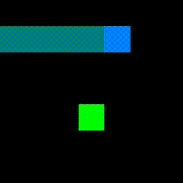

# Try to solve snake using Q-leaning

I tried variants of Q-learning including

* Prioritized replay
* Double Q-learning
* Dueling networks
* Noisy Net

They don't seem to help in this task even in combination of all of them. But multi-step Q-learning seems to help directly since it helps the agent to get actual information more than a single step bootstrap q-value. So this repo only includes multi-step q-learning as a learning algorithm.

The agent can only get to the endgame of 7x7 gamesize. I tried to run the same agent in 9x9, it only got the maximum length around 50-60. Below is the agent in action (7x7). This agent is trained for 2 millions gamesteps (around 2 hours on google colab).

My guess to reach endgame of bigger size is to have explicit planning (e.g. monte carlo tree search) but the training process could be much longer.